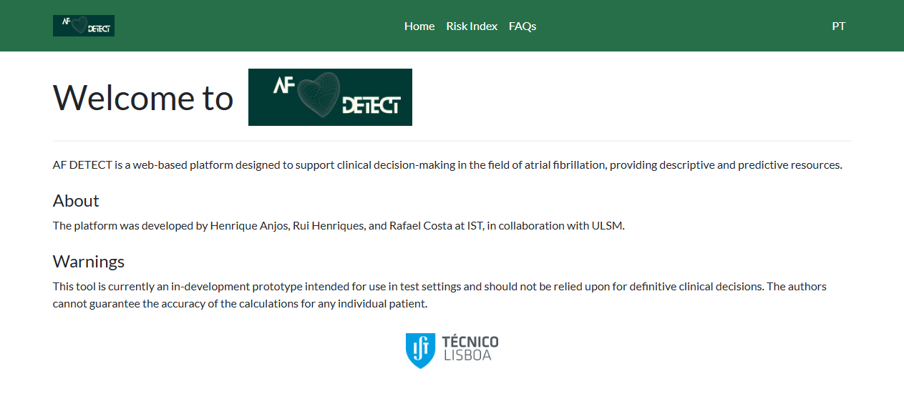
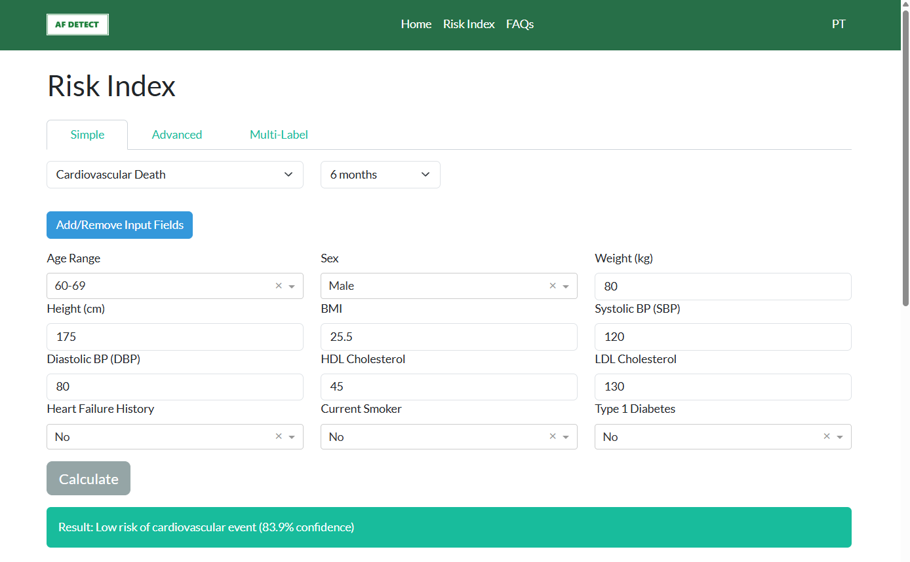
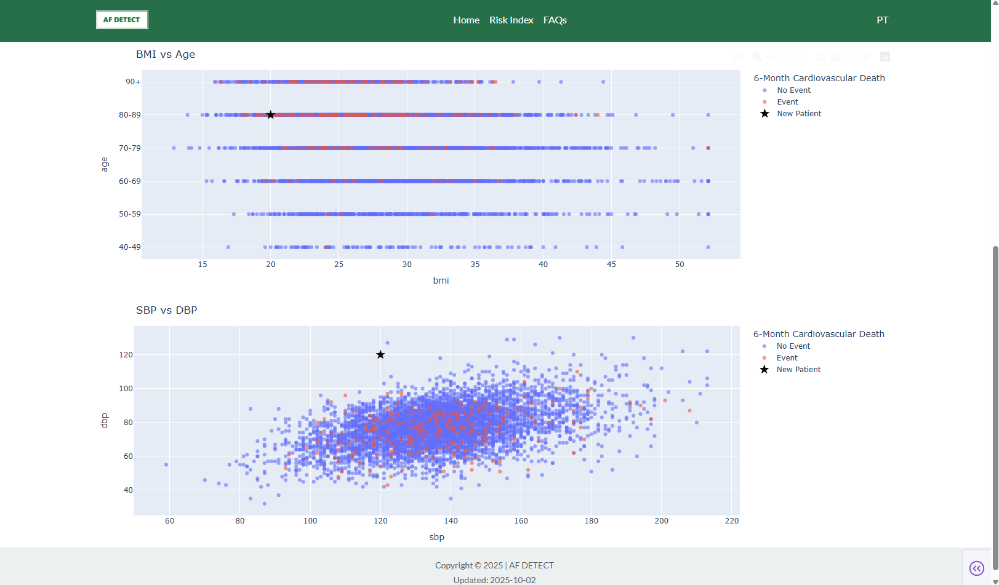

# Thesis

This repository contains the thesis developed at Instituto Superior Técnico (IST) entitled “Prediction of Atrial Fibrillation Risks at Primary Care Level using Longitudinal Learning Stances”, conducted in collaboration with ULS Matosinhos.

The thesis analyzes a longitudinal cohort of patients with atrial fibrillation and develops machine learning models to predict AF-related outcomes. In addition, it presents AF DETECT, a web-based platform designed to support clinicians in clinical decision-making.

The source code is maintained in the ULSM repository and included here as a submodule.

Special thanks to IST Professor Rui Henriques, and FCT Professor Rafael Costa for their supervision and guidance throughout the scientific work.

## Abstract
Atrial fibrillation (AF) is the most prevalent cardiac arrhythmia worldwide and is strongly associated with increased risks of stroke, heart failure, and mortality. Traditional methods to detect and prognostic AF and its associated risks often fail to capture the full complexity of AF patterns, ,limiting their predictive accuracy. In spite of the improvements achieved by machine learning (ML) techniques, state-of-the-art AF-focused predictors do not generally incorporate longitudinal data, reducing their capacity to model the dynamic and evolving nature of individual behaviors and cardiophysiological indicators over time. The absence of a longitudinal perspective restricts understanding of how AF risk develops and changes across different prediction horizons. This study addresses these limitations by developing superior ML models tailored to predict adverse events within a longitudinal cohort of individuals with AF,while also laying the groundwork for future models that predict AFonset. Our work focuses on six critical clinical endpoints: stroke all-cause death, cardiovascular death, heart failure hospitalizations,inpatient visits, and acute coronary syndrome. The ML modelsyielded an AUC of 0.65 for 1-year stroke prediction, outperforming CHA2DS2-VASc (0.59) and GARFIELD-AF (0.63). For all-cause mortality prediction, the models achieved an AUC of 0.78 against the0.72 reference of GARFIELD-AF. In addition to predictive advances,the study identifies determinants of AF-related risks and introducesa prototype decision-support tool for clinical use. The work wasconducted in collaboration with ULS Matosinhos, which reviewedand validated the findings.

## AF DETECT

AF DETECT is a web-based platform designed to support clinical decision-making in the field of atrial fibrillation, providing descriptive and predictive resources.

 

 
 